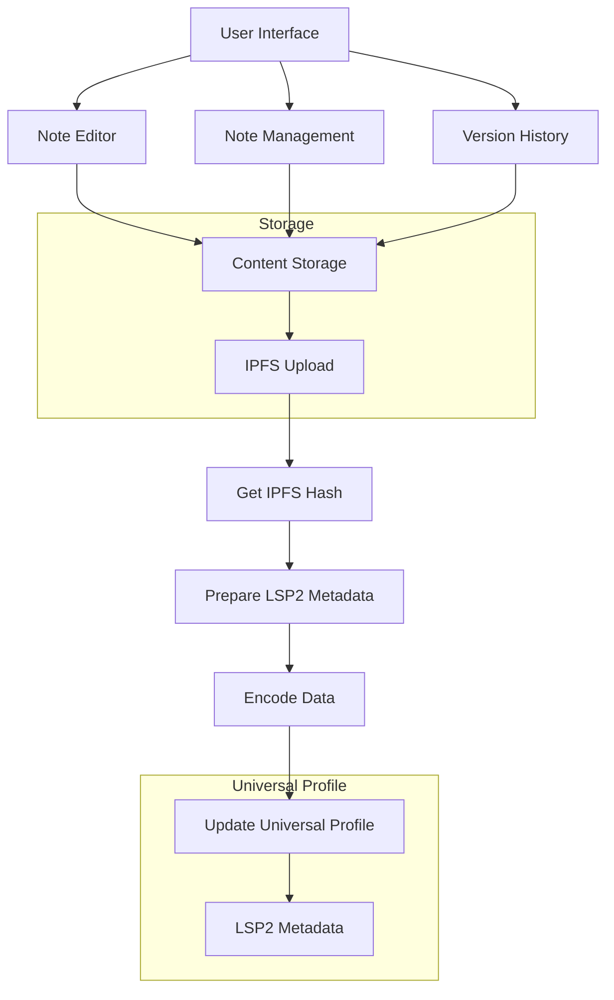

# Notes On-Chain - Private Note-Taking for Universal Profiles

Notes On-Chain is a privacy-focused note-taking application built for the LUKSO ecosystem, designed to store and reference your notes securely with blockchain technology while keeping the content private and accessible only to you. By leveraging Universal Profiles and LSP2 metadata, your notes move with your digital identity, always available wherever you go.

## 🌟 Key Features

### Privacy & Security
- **Privacy-First Design**: Notes stored on Pinata's private IPFS network
- **On-Chain References**: Only IPFS hash stored in your Universal Profile's LSP2 metadata
- **Private Content**: Only you can access and view your content
- **Ownership**: True note ownership through your Universal Profile

### User Experience
- **Rich Text Editor**: Powerful formatting options and organization tools
- **Version History**: Track changes to your notes over time
- **Mobile Responsive**: Seamless experience across desktop and mobile devices

### Technical Integration
- **Universal Profile Integration**: Seamless connection with your digital identity
- **IPFS Storage**: Decentralized content storage via Pinata

## 🚀 Value Proposition

### For the LUKSO Ecosystem
1. **Practical Utility**: Demonstrates practical everyday use case for Universal Profiles
2. **Privacy Showcase**: Highlights how private data can be securely referenced on-chain
3. **User Adoption**: Provides familiar functionality (notes) with on-chain benefits

### For Users
1. **Data Sovereignty**: You own your notes, not a centralized service
2. **Privacy Protection**: Your note content remains private
3. **Identity Integration**: Notes tied to your Universal Profile
4. **Portability**: Access your notes from any device with your universal profile

## 🔮 Future Improvements

### Technical Enhancements
1. **Collaboration Features**
   - Selective note sharing with other Universal Profiles
   - Real-time collaborative editing

2. **Enhanced Organization**
   - Folders and tagging system
   - Better search functionality with content indexing
   - Favorites and pinned notes

3. **Rich Media Support**
   - Image embedding and storage
   - File attachments and multimedia support

4. **Backup & Restore**
   - Export/import functionality
   - Multiple backup options

### Ecosystem Integration

1. **Cross-Mini-App Integration**
   - Connect with other LUKSO mini-apps
   - Share notes to social platforms or other services

2. **Advanced Profile Integration**
   - Use LSP8 NFTs for premium features
   - Build social proof around content creation

## 🛠️ Technical Stack

- **Frontend**: Next.js 14
- **Styling**: Tailwind CSS
- **Editor**: Slate.js for rich text editing
- **Blockchain**: viem for blockchain interactions
- **Universal Profile**: UP Provider
- **Data Schemas**: ERC725.js, LSP2 metadata
- **IPFS Storage**: Pinata API
- **State Management**: React Context

## 📐 Architecture



### Flow Description

1. **User Interface Layer**
   - Rich text editor with formatting tools (Slate)
   - Note management interface with create/edit/delete
   - Version history viewer

2. **Data Layer**
   - Local note state management
   - IPFS storage for note content via Pinata
   - Universal Profile LSP2 metadata references

3. **Process Flow**
   - User creates or edits a note
   - Content is prepared and uploaded to IPFS
   - IPFS hash is retrieved
   - LSP2 metadata is updated with the hash
   - Universal Profile is updated with new metadata

4. **Integration Points**
   - Universal Profile Provider for blockchain interaction
   - IPFS (Pinata) for private content storage
   - Slate.js for rich text editing capabilities

## 🚀 Getting Started

1. Clone the repository:
```bash
git clone https://github.com/yourusername/notes-on-chain.git
cd notes-on-chain
```

2. Install dependencies:
```bash
npm install
```

3. Create a `.env` file:
```env
PINATA_API_KEY=your_pinata_api_key
PINATA_API_SECRET=your_pinata_api_secret
```

4. Start the development server:
```bash
npm run dev
```

5. Visit the app in your browser:
```
http://localhost:3000
```

## How to Test on Universal Everything

1. Visit [universaleverything.io](https://universaleverything.io)
2. Connect your Universal Profile
3. Add a new grid item with your deployed Notes On-Chain URL
4. Click on the grid item to open the mini-app
5. Start creating your private notes, securely stored on the blockchain

## 🤝 Contributing

We welcome contributions! Please feel free to submit a Pull Request.

## 📝 License

[MIT License](LICENSE)

Made with ❤️ for the LUKSO community
